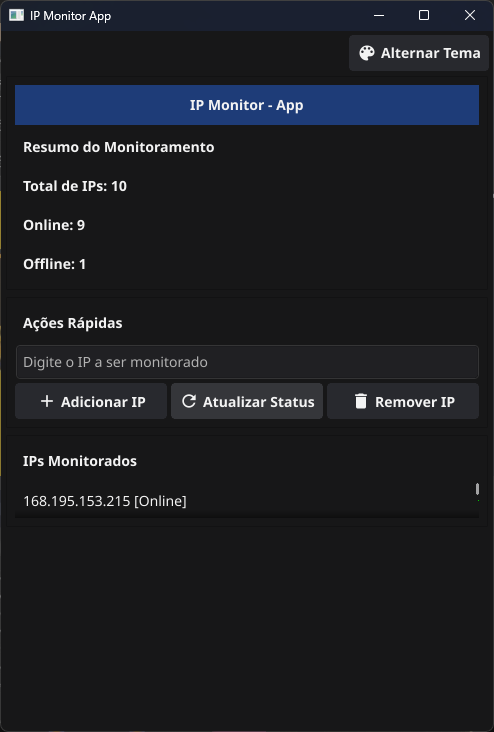
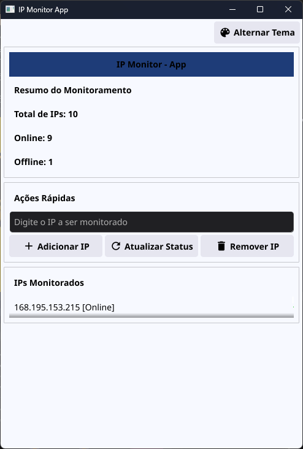

# IP Monitor App

<p align="center">
  
  
</p>

Aplicativo multiplataforma em Go para monitoramento de IPs (online/offline) com interface gráfica (Fyne) e persistência local em SQLite3.

## Funcionalidades
- Cadastro de IPs para monitoramento
- Listagem dinâmica dos IPs monitorados
- Remoção de IPs
- Atualização do status (online/offline) manual
- Interface gráfica moderna baseada em cartões/seções
- Persistência automática em banco SQLite3 local
- Validação de IP na inclusão

## Requisitos
- Go 1.18 ou superior (recomendado Go 1.20+)
- Git (opcional, para clonar o repositório)
- Sistema operacional: Windows, Linux ou macOS

## Instalação

1. **Clone o repositório (opcional):**
   ```sh
   git clone <url-do-repositorio>
   cd ipMonitorApp
   ```

2. **Baixe as dependências:**
   ```sh
   go mod tidy
   ```

3. **Compile e execute:**
   ```sh
   go run main.go
   ```
   Ou para gerar o executável:
   ```sh
   go build -o ipmonitorapp.exe main.go
   ./ipmonitorapp.exe
   ```
   (No Linux/macOS, use `./ipmonitorapp`)

## Executando sem abrir o terminal (Windows)

Para que o aplicativo rode apenas com a interface gráfica, sem abrir o terminal cmd junto:

1. Compile usando o comando abaixo:
   ```sh
   go build -ldflags="-H=windowsgui" -o ipMonitor-gui.exe main.go
   ```
2. Execute o arquivo `ipMonitor-gui.exe` normalmente. Apenas a janela gráfica será exibida.

Se desejar rodar pelo terminal (para ver logs), use o comando padrão:
```sh
   go run main.go
```

## Como usar

1. **Adicionar IP:**
   - Digite o endereço IP no campo "Digite o IP a ser monitorado".
   - Clique em "Adicionar IP".
   - Apenas IPs válidos são aceitos.

2. **Atualizar status:**
   - Clique em "Atualizar Status" para verificar se os IPs estão online ou offline.

3. **Remover IP:**
   - Selecione um IP na lista.
   - Clique em "Remover IP".

4. **Resumo:**
   - O topo da interface mostra o total de IPs cadastrados e o status geral (online/offline).

## Banco de Dados
- O arquivo `ipmonitor.db` é criado automaticamente na primeira execução, no mesmo diretório do aplicativo.
- Não é necessário configurar nada manualmente.

## Observações
- O status "Online" é determinado por uma tentativa de conexão TCP na porta 80 do IP.
- O app não faz atualização automática em background (apenas manual).
- O app aceita tanto IPv4 quanto IPv6 válidos.

## Personalização e Extensão
- O código segue o padrão MVC (Model-View-Controller) para facilitar manutenção e evolução.
- Para internacionalização, melhorias visuais ou automação, contribua ou solicite via issues.

## Suporte
- Dúvidas, sugestões ou bugs: abra uma issue no repositório ou entre em contato com o desenvolvedor.

## Build multiplataforma (Makefile e make.bat)

### Windows
Para compilar o app no Windows, utilize o script:
```bat
make.bat
```
Isso irá gerar o executável `ipMonitorApp-win.exe` na raiz do projeto.

### Linux/macOS
No terminal:
```sh
make linux     # Gera ipMonitorApp-linux
make macos     # Gera ipMonitorApp-macos
make all       # Gera para todas as plataformas (exceto Windows)
make clean     # Remove os binários gerados
```

Os binários gerados ficam na raiz do projeto.

## Como executar o Makefile no Windows

1. Instale o Make para Windows:
   - Via Chocolatey:
     ```sh
     choco install make
     ```
   - Ou via Scoop:
     ```sh
     scoop install make
     ```
   - Ou baixe manualmente em: https://gnuwin32.sourceforge.net/packages/make.htm
   
   - Instale a extensão [Makefile Tools](https://marketplace.visualstudio.com/items?itemName=ms-vscode.makefile-tools)

2. Feche e reabra o terminal após a instalação (para garantir que o comando make esteja no PATH).

3. Navegue até a pasta do projeto e execute:
   ```sh
   make windows
   ```
   Ou qualquer outro comando do Makefile conforme desejado.

Se aparecer erro de comando não encontrado, adicione o caminho do make.exe ao PATH do sistema.

## Build para Android e iOS (Fyne)

Para gerar o app para Android e iOS, é necessário:
- Instalar o [Fyne CLI](https://developer.fyne.io/started/packaging)
- Ter o ambiente de build configurado (Android SDK/NDK para Android, Xcode para iOS)
- Ter um ícone chamado `Icon.png` na raiz do projeto

### Android
```sh
make android   # Gera o APK na pasta 'fyne-cross/dist' ou na raiz
```

### iOS
```sh
make ios       # Gera o pacote iOS na pasta 'fyne-cross/dist' ou na raiz
```

Veja a documentação oficial do Fyne para detalhes de publicação e testes em dispositivos reais.

---

Desenvolvido com Go, Fyne e SQLite3.
