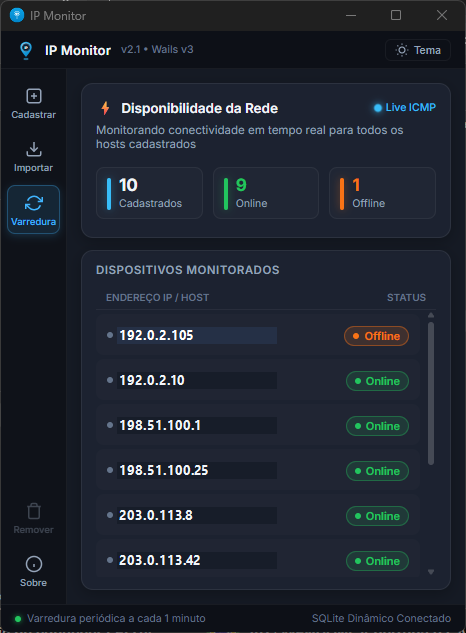
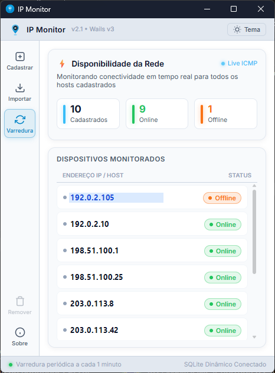

# IP Monitor App

Aplicativo moderno, ultra-leve e portátil em Go para monitoramento de IPs e conectividade de rede em tempo real, construído com interface nativa em [Wails v3](https://v3.wails.io) e persistência local com SQLite3.

Inspirado no design minimalista e moderno do Microsoft PC Manager, o **IP Monitor App** entrega uma experiência de alto padrão visual com temas Claro e Escuro, animações fluidas e zero dependências externas.

---

## 📸 Interface do Aplicativo

<div align="center">
  <table>
    <tr>
      <td align="center"><b>Tema Escuro (Dark Mode)</b></td>
      <td align="center"><b>Tema Claro (Light Mode)</b></td>
    </tr>
    <tr>
      <td></td>
      <td></td>
    </tr>
  </table>
</div>

---

## ✨ Funcionalidades Principais

- **Executável Único e Portátil**: Frontend e backend 100% integrados em um binário autocontido (`ipMonitorApp.exe` de ~13 MB).
- **Zero DLLs ou Pastas Externas**: Utiliza o WebView2 nativo do Windows, sem necessidade de arquivos `.dll` adicionais na pasta.
- **SQLite Dinâmico e Portátil**: Detecta automaticamente a pasta de execução e cria/utiliza o banco `ipmonitor.db` localmente.
- **Filtro Inteligente de Prioridade**: Hosts **Offline** aparecem automaticamente no topo da lista para atenção e diagnóstico imediatos.
- **Identificação Visual Suave**: Indicadores de status refinados, incluindo destaque suave em tom vermelho-alaranjado para hosts inacessíveis.
- **Cadastro com Modal Bloqueante**: Diálogo modal sobreposto na seção de disponibilidade, impedindo cliques externos e garantindo foco total no cadastro.
- **Barra Lateral com Ações Rápidas**:
  - **Cadastrar**: Abertura rápida do modal de novo host com placeholder orientativo (`Ex: 192.168.1.1 ou host.local`).
  - **Importar**: Leitura em lote de arquivos `.json` com validação e sanitização automática de IPs/hosts.
  - **Varredura**: Disparo manual de ICMP Ping imediato com animação rotativa no ícone e feedback visual no status.
  - **Remover**: Exclusão de host selecionado com confirmação imediata.
- **Varredura Automática em Background**: Verificação periódica a cada 1 minuto mantendo o painel de disponibilidade sempre atualizado.
- **Temas Claro e Escuro**: Alternância instantânea com contraste polido e compatibilidade nativa com o Windows 10/11.

---

## 🛠️ Requisitos de Desenvolvimento

- **Go 1.25** ou superior
- **Compilador C (GCC / MinGW-w64)** no Windows (necessário para o driver CGO do SQLite3)
- **WebView2 Runtime** (já incluído nativamente no Windows 10 e Windows 11)

---

## 🚀 Compilação e Execução

O projeto conta com um **Makefile unificado** multiplataforma que detecta automaticamente o sistema operacional (Windows, Linux ou macOS):

```sh
make build   # Compila o executável único e portátil
make test    # Executa todos os testes unitários do serviço
make run     # Compila e inicia o aplicativo imediatamente
make clean   # Remove executáveis e resíduos temporários de build
make info    # Exibe dados do ambiente, SO detectado e flags de compilação
```

> 💡 **Dica no Windows**: Usando MinGW-w64 (WinLibs), você pode executar `mingw32-make` ou `make`. As flags `-H=windowsgui` são aplicadas automaticamente para compilar sem console acoplado.

---

## 📖 Como Usar

1. **Cadastrar IP ou Hostname**:
   - Clique em **Cadastrar** na barra lateral. O modal central sobreposto será exibido com a interface principal bloqueada. Digite o endereço e pressione `Enter` ou clique em `Cadastrar`.
2. **Realizar Varredura Manual**:
   - Clique no botão **Varredura** na barra lateral. O ícone girará enquanto os pings ICMP são emitidos e a lista e os cards de disponibilidade serão atualizados.
3. **Importar Lista em Lote**:
   - Clique em **Importar** na barra lateral e selecione o arquivo `.json` contendo a lista de hosts.
4. **Remover Host**:
   - Selecione a linha do host desejado na lista e clique no botão **Remover** na barra lateral.
5. **Alternar Tema**:
   - Clique no botão **Tema** no canto superior direito para alternar dinamicamente entre os modos Escuro e Claro.

---

## 💾 Banco de Dados Local

O banco de dados SQLite (`ipmonitor.db`) é resolvido dinamicamente no diretório onde o executável se encontra. O aplicativo pode ser copiado para qualquer diretório ou pendrive sem perder suas configurações e histórico.

---

Desenvolvido com **Go**, **Wails v3** e **SQLite3**.
