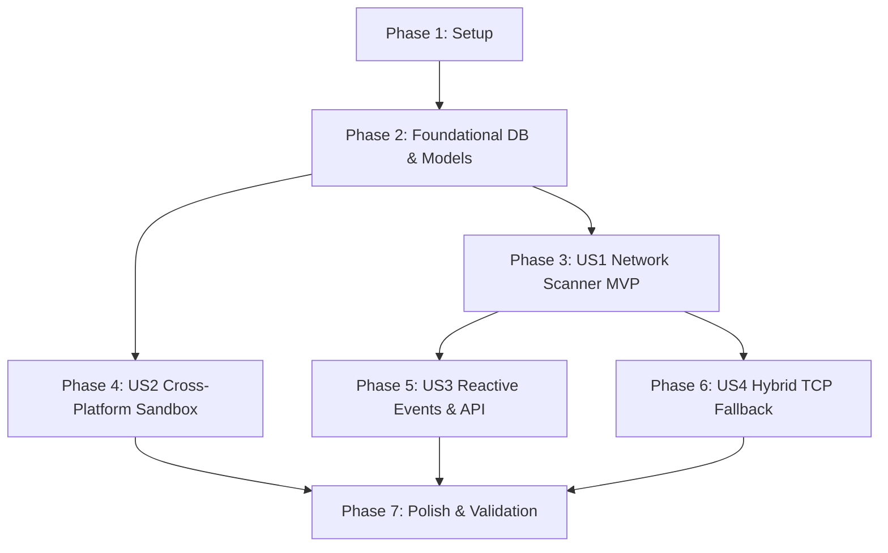

# Tasks: Backend Core & Resilient Multiplatform Engine

**Branch**: `001-backend-core` | **Spec**: [spec.md](file:///c:/Users/conta/OneDrive/AppProjects/GolangProjects/ipMonitorApp/specs/001-backend-core/spec.md) | **Plan**: [plan.md](file:///c:/Users/conta/OneDrive/AppProjects/GolangProjects/ipMonitorApp/specs/001-backend-core/plan.md)

---

## Phase 1: Setup (Shared Infrastructure)

**Purpose**: Verify repository structure, Go 1.25 toolchain, zero-CGO dependencies and build scripts.

- [x] T001 Verify Go module dependencies (`go.mod`, `go.sum`) with pure Go driver `modernc.org/sqlite` and `github.com/go-ping/ping`
- [x] T002 [P] Verify Makefile targets for cross-platform builds with `CGO_ENABLED=0` (`build-windows`, `build-darwin`, `build-linux`) in `Makefile`
- [x] T003 [P] Configure/verify testing framework and mock utilities in `internal/testutil/testutil.go`

---

## Phase 2: Foundational (Blocking Prerequisites)

**Purpose**: Core data entities, multiplatform SQLite resolution, and database migration framework that MUST be complete before user stories can run.

- [x] T004 Implement dynamic path resolver with macOS App Support sandbox compliance and Windows portable resolution in `internal/model/resolver.go`
- [x] T005 [P] Implement unit tests for path resolver across simulated platforms (`GOOS=darwin`, `GOOS=windows`) in `internal/model/resolver_test.go`
- [x] T006 Define core models (`Host`, `AppSettings`, `NetworkOverview`) with JSON and database mappings in `internal/model/host.go` and `internal/model/settings.go`
- [x] T007 Implement pure Go SQLite connection pooling, WAL mode, busy timeout, and schema migrations in `internal/model/db.go`
- [x] T008 [P] Write integration tests for SQLite schema migration and CRUD operations in `internal/model/db_test.go`

**Checkpoint**: Foundation ready — database and data structures are fully functional and tested.

---

## Phase 3: User Story 1 - Real-time Network Reachability Monitoring (Priority: P1) 🎯 MVP

**Goal**: Concurrently scan network targets (IPv4/IPv6/URLs/Hostnames) via ICMP, calculate latencies and packet losses without spawning console windows on Windows.

**Independent Test**: Add 3 hosts (e.g. `1.1.1.1`, `8.8.8.8`, and an invalid IP `192.0.2.1`), run probe routine, verify latencies, packet loss rates, and state transitions to `online` or `offline`.

### Tests for User Story 1
- [x] T009 [P] [US1] Unit test for single-target ICMP probe with timeout in `internal/service/pinger_test.go`
- [x] T010 [P] [US1] Integration test for concurrent worker pool scanner in `internal/service/monitor_test.go`

### Implementation for User Story 1
- [x] T011 [US1] Implement ICMP engine with OS-specific privileges (`SetPrivileged(true)` on Windows, `false` on Unix) and hidden fallback command attributes (`CREATE_NO_WINDOW`) in `internal/service/pinger.go`
- [x] T012 [US1] Implement bounded concurrent worker pool and scanning loop with `context.Context` cancellation in `internal/service/monitor.go`
- [x] T013 [US1] Implement host status transitions and metric updates (`PacketsSent`, `PacketsRecv`, `PacketLoss`, `AvgLatency`) in `internal/service/host_service.go`

**Checkpoint**: User Story 1 is functional — network targets are scanned concurrently, silently, and accurately.

---

## Phase 4: User Story 2 - Resilient Cross-Platform Persistence & Sandboxing (Priority: P1)

**Goal**: Guarantee zero `readonly database` errors in macOS `/Applications` and seamless zero-install execution in Windows portable folders.

**Independent Test**: Run database initialization under simulated read-only directory and verify graceful fallback to user application support directory.

### Tests for User Story 2
- [x] T014 [P] [US2] Test filesystem permission fallback when current directory is read-only in `internal/model/resolver_test.go`

### Implementation for User Story 2
- [x] T015 [US2] Add automatic directory creation (`0755`) and path validation in `internal/model/resolver.go`
- [x] T016 [US2] Implement transaction-safe atomic batch updates for host statistics to minimize SQLite disk writes in `internal/model/host_repository.go`

**Checkpoint**: User Story 2 is verified — SQLite persistence runs reliably across sandboxed macOS and portable Windows environments.

---

## Phase 5: User Story 3 - Reactive Event Dispatching & Dual Service Surface (Priority: P2)

**Goal**: Expose backend functionality to frontend via Wails v3 event bus (`ips-updated`) and local REST endpoints (`/api/...`), completely eliminating client polling.

**Independent Test**: Register mock listener on event bus, trigger a scan, and verify complete `NetworkOverview` JSON payload. Request `/api/hosts` and receive same status.

### Tests for User Story 3
- [x] T017 [P] [US3] Contract test for REST API endpoints (`/api/hosts`, `/api/settings`, `/api/ping`) in `internal/api/rest_test.go`
- [x] T018 [P] [US3] Unit test for Wails v3 event emission logic in `internal/service/event_emitter_test.go`

### Implementation for User Story 3
- [x] T019 [US3] Implement HTTP REST router and handlers in `internal/api/rest.go`
- [x] T020 [US3] Implement Wails v3 native service binding bridge in `internal/api/bindings.go`
- [x] T021 [US3] Connect monitor worker completion hook to reactive event emitter (`app.Event.Emit("ips-updated", overview)`) in `main.go`

**Checkpoint**: User Story 3 is complete — frontend receives reactive broadcasts without polling loops.

---

## Phase 6: User Story 4 - Multi-level Hybrid Connectivity Fallback (Priority: P2)

**Goal**: Provide TCP port probes (80, 443, 22, 53, etc.) when ICMP packets are dropped by corporate firewalls.

**Independent Test**: Probe an IP with blocked ICMP but open port 80/443; confirm host status updates to `online (tcp)` with measured round-trip time.

### Tests for User Story 4
- [x] T022 [P] [US4] Unit test for TCP probe fallback logic with mock listener in `internal/service/tcp_probe_test.go`

### Implementation for User Story 4
- [x] T023 [US4] Implement TCP dialer fallback probe (`net.DialTimeout`) with configurable ports in `internal/service/pinger.go`
- [x] T024 [US4] Update status evaluation logic in `internal/service/host_service.go` to flag TCP reachability

**Checkpoint**: All user stories implemented — reachability diagnoses are resilient against strict firewall rules.

---

## Phase 7: Polish & Cross-Cutting Concerns

**Purpose**: macOS window lifecycle hooks, end-to-end validation, and build hygiene.

- [x] T025 [P] Verify macOS window hide on close (`events.Common.WindowClosing`) and Dock reopen in `main.go`
- [x] T026 [P] Verify `NSAppTransportSecurity` local networking configuration in `build/darwin/Info.plist`
- [x] T027 Run full test suite (`go test -v ./...`) with race detector (`-race`)
- [x] T028 Run end-to-end quickstart scenarios in `specs/001-backend-core/quickstart.md`

---

## Dependencies & Execution Order

